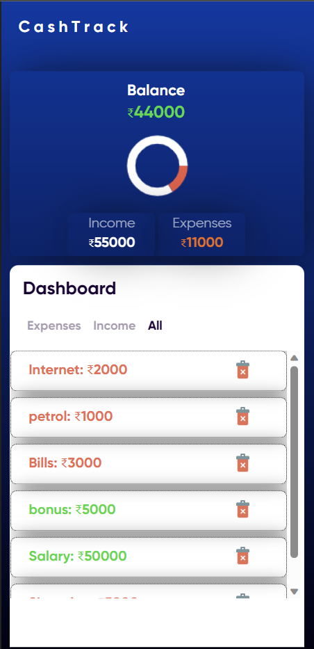
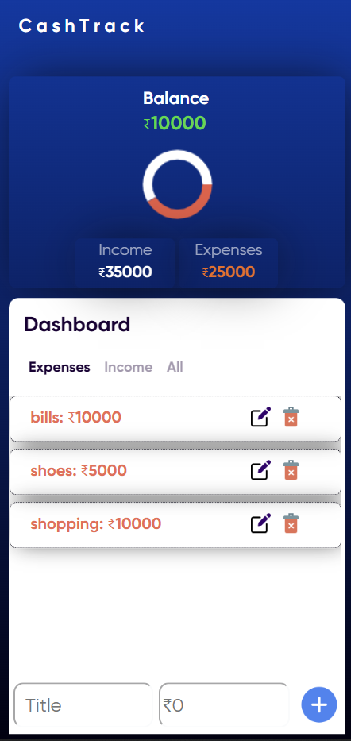
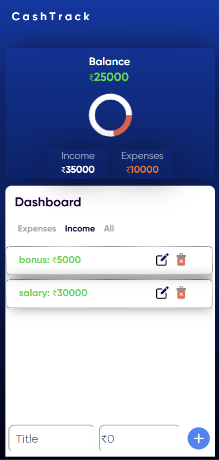

# CashTrack 

<h1> CashTrack - Personal Budget Web App </h1> 

# About
• Developed a personal budgeting app using HTML, CSS, and vanilla JavaScript • Created an application with mobile and desktop compatibility that enables users to easily input income and expenses, and track their spending • Created a dynamic circular chart using HTML5 canvas and JavaScript, with functions to draw and update the chart with new data, displaying income to expense ratio • Demonstrated creativity and problem-solving skills by developing a unique and practical app that addresses a common need and demonstrate Software Development

## Website is Live : [https://atha2810.github.io/CashTrack.github.io/](https://atha2810.github.io/CashTrack.github.io/)

# Screenshots
<h2>All Entries👆</h2>
<h2>Expenses Entries👆</h2>
<h2>Income Entries👆</h2>

# Tech Stack

